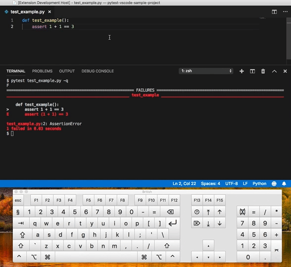

# Re-run Last Command in Terminal

Quickly repeat the last command in your terminal without leaving the text editor.

By default this is bound to `ctrl+f7` or `cmd+f7` (mac).

You can rebind this in the [Keyboard Shorcuts Editor](https://code.visualstudio.com/docs/getstarted/keybindings#_keyboard-shortcuts-editor) looking for the `extension.rerunLastCommand` Command.

## Extension Settings

- `rerun.command`: The command run in the terminal to repeat the last command, by default this is `!!` (works across bash, zsh)

### Contributing

Contribution to this extension are welcome! Before submitting any changes, please first discuss the changes you wish to make via an issue.

**Enjoy!**
